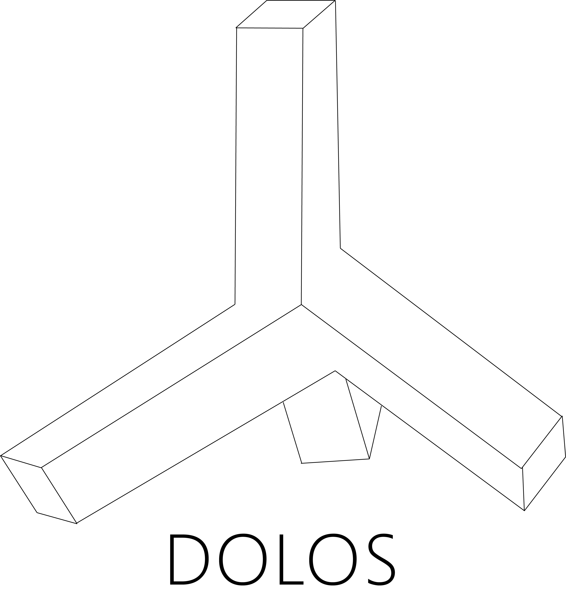

<p align="center"></p>


<h1 align="center"> Dolos </h1>

<p align="center"> 
A handy data mocking api to generate data in  given schema
</p>
<div align="center">

[](https://acmvit.in/)


[](https://en.wikipedia.org/wiki/MIT_License)
[](https://github.com/ACM-VIT/dolos/network)
[](https://github.com/ACM-VIT/dolos/stargazers)


</div>

---

Ever wanted to get random data for that app you were building, say no more. Dolos, the god of deception and trickery is here for you.

---

## Contribute

To take part in the development of this project, refer the github projects board. We have setup beginner level issues, and labelled them as well ! Feel free to claim any issue (or open a new one) and contribute to the development of the project.

---

## Usage

To setup project locally, fork the repository.

```console
# install dependencies
npm install

# run the server
npm run server
```

---

# Docker

### 🐳 Run and develop through Docker (Optional)

The docker-compose.yml file contain:

- **phpMyAdmin**: \*For database manager.\*\*
- **MySQL**: _The database itself_
- **Dolos**: _The Dolos application_
- **Portainer**: _To monitoring your container services, such as logs, restart and more._

For development, you can run the Dolos using Docker Compose by following this steps below:

- Adjust `.env` with some dependencies variables.
- Run `docker-composer up -d` for build all containers and prepare them to the first run.
- Run `docker-composer up ` and that's it, let's code!
- If you want to stop, run `docker-compose down`

The IP address to use:

```sh
- phpMyAdmin: 0.0.0.0:8081
- Dolos: 0.0.0.0:3000
- Portainer: 0.0.0.0:9000
```

- To connect on **Portainer**, do the follow steps:
  1. You'll need to create a password for local admin account.
  2. Choose the option: "**Docker** _manage the local Docker environment_".
  3. Done, you're now able to manage the containers.

## Contribution

Readup the [detailed plan](docs/PLAN.md) of the project and how to contribute [here](docs/SUBMITTING_PULL_REQUEST.md).

## Hackers !

[](https://github.com/ACM-VIT/dolos/graphs/contributors)
